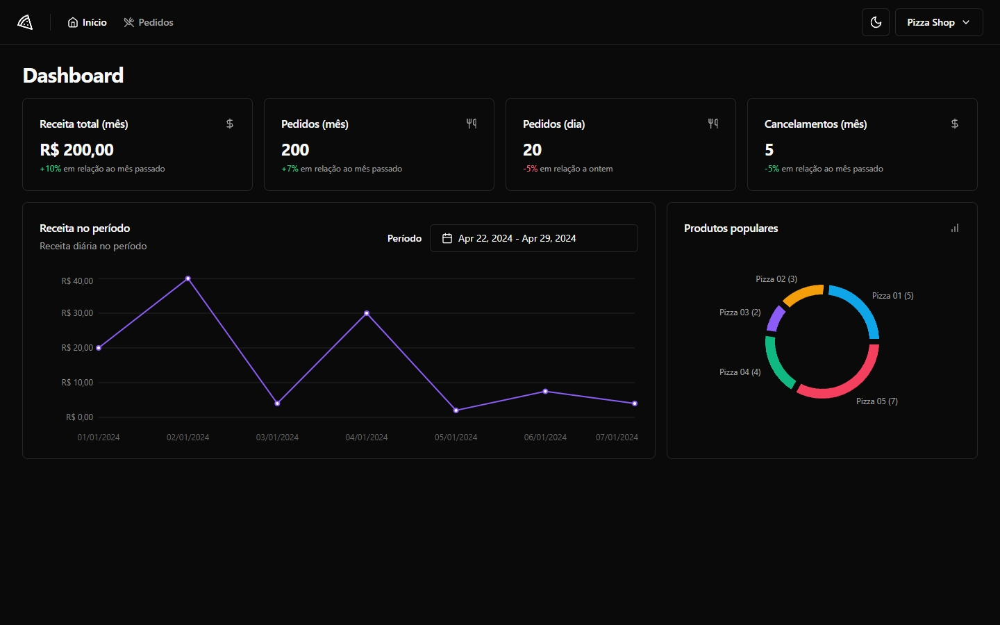

<p align="center">
  
   
  
</p>

<p align="center">
  <a href="#dart-sobre">Sobre</a> &#xa0; | &#xa0;
  <a href="#books-aprendizado">Aprendizado</a> &#xa0; | &#xa0;
  <a href="#rocket-tecnologias">Tecnologias</a> &#xa0; | &#xa0;
  <a href="#warning-pré-requisitos"> Pré requisitos</a> &#xa0; | &#xa0;
  <a href="#checkered_flag-começando">Começando</a> &#xa0; | &#xa0;
  <a href="https://github.com/geovaneborba" target="_blank">Autor</a>
</p>

<br>

## :dart: Sobre

<p>
  Um dashboard para gestão de estabelecimentos e controle de pedidos inspirado no estilo do iFood. Esse projeto tem como foco exercitar a comunicação da aplicação front-end com API (back-end) via requisições HTTP.

O projeto contém as seguintes funcionalidades:

- Cadastro de estabelecimento;
- Login de estabelecimento (magic link);
- Cadastro como cliente;
- Gestão de pedidos;
- Paginação da lista de pedidos;
- Filtros da lista de pedidos;
- Gestão do perfil do estabelecimento;
- Métricas p/ dashboard
  - Média de receita total mês
  - Média de pedidos por mês;
  - Média de pedidos por dia;
  - Média de cancelamento de pedidos por mês;
  - Gráfico de receitas nos últimos 7 dias;
  - Gráfico de produtos populares;

</p>

<p align="right">(<a href="#top">Voltar para o topo</a>)</p>

## :books: Aprendizado

- Autenticação JWT
- Caching e revalidação
- Conexão com back-end (API)
- Testes unitários
- Testes end-to-end
- Interface Otimista
- Mock

<p align="right">(<a href="#top">Voltar para o topo</a>)</p>

## :rocket: Tecnologias

As seguintes tecnologias foram usadas na construção do projeto:

- React
- React Router DOM
- Tailwind
- shadcn/ui
- React Query
- Radix
- Recharts

<p align="right">(<a href="#top">Voltar para o topo</a>)</p>

## :warning: Pré-requisitos

Antes de começar, você precisa ter o [Git](https://git-scm.com) e o [Node](https://nodejs.org/en/) instalados em sua maquina. E também você irá precisar de um PostgreSQL rodando em sua máquina

<p align="right">(<a href="#top">Voltar para o topo</a>)</p>

## :checkered_flag: Começando

O projeto pode ser inicializado utilizando os mocks de dados simulados ou caso queira e possível consumir os dados reais através da API.

### Utilizando Mocks

```bash
# Clone o repositório
$ git clone https://github.com/geovaneborba/ignite-pizzashop-web.git

# Entre na pasta
$ cd ignite-pizzashop-web

# Instale as dependências
$ npm install

# Para iniciar o projeto com a api mocked
$ npm run dev:mock

# O app vai inicializar e será informado no terminal o endereço e porta onde estará rodando a aplicação.
```

### Utilizando API

```bash
# Clone os repositórios abaixo
$ git clone https://github.com/geovaneborba/ignite-pizzashop-web.git
$ git clone https://github.com/geovaneborba/ignite-pizzashop-api.git

# Entre na pasta e instale as dependências
$ cd ignite-pizzashop-api && npm install

# Abra o arquivo .env.local e insira as configurações necessárias, como credenciais do banco de dados e chaves JWT

# Execute as migrações do banco de dados
$ npm run migrate

# Preencha o banco de dados com dados de amostra
$ npm run seed

# Inicie o servidor da API
$ npm run dev

# Em outra janela do terminal, entre na pasta do projeto web, instale as dependências e inicie o projeto
$ cd ../pizzashop-web && npm install
$ npm run dev

# O aplicativo será iniciado e você receberá informações no terminal sobre o endereço e a porta onde ele estará disponível

```

<p align="right">(<a href="#top">Voltar para o topo</a>)</p>

<p align="center">Feito com ❤️ por <a href="https://github.com/geovaneborba" target="_blank">Geovane Borba</a></p>
